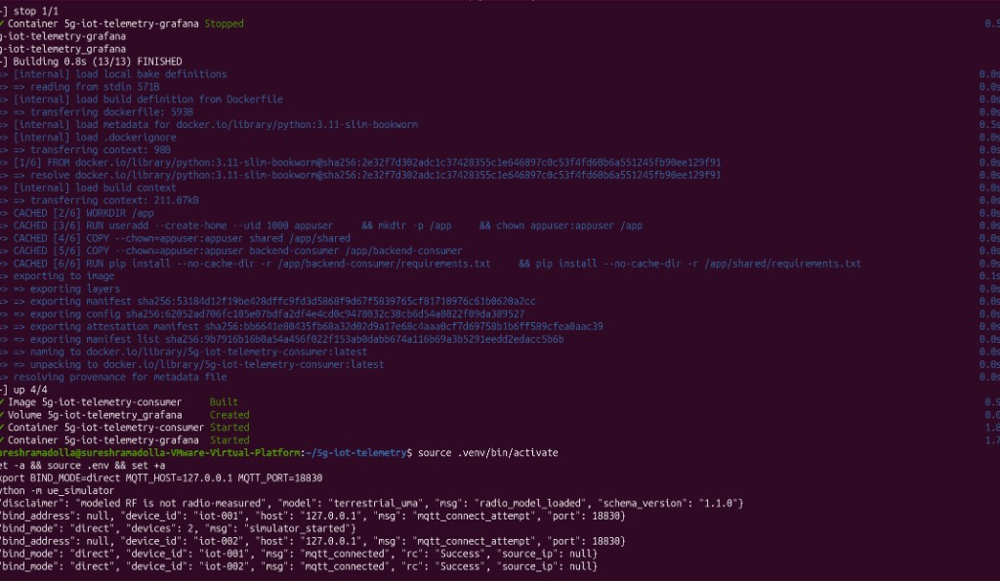
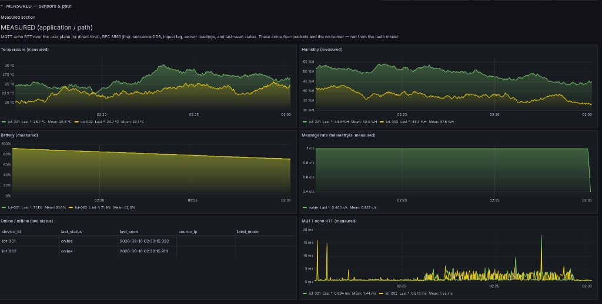
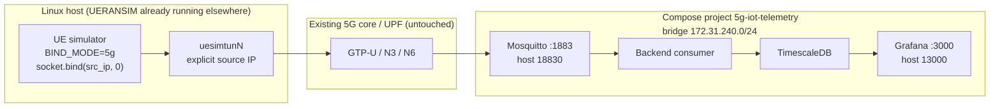
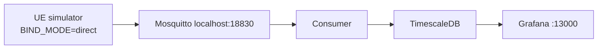

# 5G IoT Telemetry Lab

### Isolated MQTT ingest — Mosquitto, TimescaleDB, Grafana (host ports 18830 / 13000)


---

## Table of Contents

1. [Overview](#overview)
2. [Live Demo](#live-demo)
3. [Project Structure](#project-structure)
4. [Isolation](#isolation)
5. [Architecture](#architecture)
6. [Tech Stack](#tech-stack)
7. [Installation](#installation)
8. [MQTT contract](#mqtt-contract)
9. [License](#license)
10. [Author](#author)

---

## Overview

MQTT telemetry lab: a host **Python** simulator publishes device payloads. A **backend consumer** validates them and writes **TimescaleDB**. **Grafana** is provisioned. Kafka and RabbitMQ bridges exist but stay **off** unless you enable the extras profile.

Two bind modes:

| Mode | What it is |
|---|---|
| **`BIND_MODE=direct`** (captured demo) | Simulator → Mosquitto on **localhost:18830**. **Not** 5G user plane. |
| **`BIND_MODE=5g`** (optional) | Simulator binds an **explicit** `uesimtunN` source IP you put in `config/devices.yaml`. Core/RAN stay in **other** labs; this repo does not edit them. |

**Who it's for:** application-path ingest, Grafana panels, and a careful optional bind onto an existing UERANSIM tunnel.

Honesty notes: [`HONESTY.md`](HONESTY.md). Lab operator scripts live in the **private** companion repo [`5g-iot-telemetry-scripts`](https://github.com/sureshramadolla428/5g-iot-telemetry-scripts).

---

## Live Demo

There is **no hosted public cloud app**. Open Grafana on the lab host after compose is up.

Typical URL: `http://127.0.0.1:13000` (not `:3000`).

Dashboards: **5G IoT Telemetry Overview** and **5G IoT KPIs (modeled vs measured)**. KPI formulas: [docs/metrics-formulas.md](docs/metrics-formulas.md).

> **Demo success (captured run)** = compose project `5g-iot-telemetry` healthy, two devices MQTT-connected in **direct** mode, Grafana showing application-path series. That is **not** GTP-U / UERANSIM proof.

Screenshots below are from that direct-bind session. Inventory: [`docs/GITHUB_SCREENSHOTS.md`](docs/GITHUB_SCREENSHOTS.md).

### Simulator + compose (direct MQTT)



Host terminal: `docker compose up --build` for project **5g-iot-telemetry** (consumer + Grafana), then `python -m ue_simulator` with **`BIND_MODE=direct`**, **`MQTT_HOST=127.0.0.1`**, **`MQTT_PORT=18830`**. **Two simulated devices** (`iot-001`, `iot-002`) connected (`mqtt_connected` Success). Radio log: **`terrestrial_uma` modeled**, not measured. Not NTN/ATG.

- **Finding:** localhost MQTT path; two devices; RF model only.

### Grafana overview (application path)



Measured application-path panels: temperature, humidity, battery, message rate, online/offline, MQTT echo RTT for **iot-001** and **iot-002**. These are consumer/Grafana series on the direct bind, **not** radio-model KPIs.

- **Finding:** two-device ingest visible in Grafana on host port **13000**.

Geomap / KPI crops are not in this pack yet (placeholders listed in `docs/screenshots/README.md`).

---

## Project Structure

```
5g-iot-telemetry/
├── README.md
├── HONESTY.md
├── LICENSE
├── docker-compose.yml
├── ue-simulator/            # host Python publisher
├── backend-consumer/        # MQTT ingest → TimescaleDB
├── dashboard/               # Grafana provisioning
├── config/                  # schema, Mosquitto, radio model
├── shared/
├── docs/
│   ├── screenshots/
│   └── ...
└── tests/
```

Operator bash helpers (`scripts/`, `private/`) are **not** in this public tree. They live in [`5g-iot-telemetry-scripts`](https://github.com/sureshramadolla428/5g-iot-telemetry-scripts) (private).

---

## Isolation

This repository is meant to sit next to other 5G labs **without touching them**.

- Compose project name is always `5g-iot-telemetry`.
- Dedicated Docker bridge `172.31.240.0/24` (override with `DOCKER_SUBNET` in `.env`).
- Non-standard host ports: MQTT **18830**, Grafana **13000**, Postgres **15432**, consumer health **18080**, Kafka **19092**, RabbitMQ **15672/15673**.
- **Never** `network_mode: host`.
- Scripts never run `systemctl`, never kill `nr-gnb`/`nr-ue`, never apply iptables, never `docker system prune`, never unscoped `compose down`.
- Python packages install only into **this project's** `.venv`.
- Host networking changes are documented only; rollback deletes rules tagged `5g-iot-telemetry`.

Details: [docs/isolation-and-safety.md](docs/isolation-and-safety.md).

Use a **different IMSI range, DNN, and slice** if you attach extra UEs for a 5G-mode demo. This repo **does not** create Open5GS subscribers or edit sibling folders.

---

## Architecture



Direct-mode fallback (what the screenshots show — no tunnels, no core):



---

## Tech Stack

| Technology | Purpose | Notes |
|---|---|---|
| **Mosquitto** | MQTT broker | Host **18830** |
| **TimescaleDB** | Telemetry store | Host **15432** |
| **Grafana** | Dashboards | Host **13000** |
| **Python** | Simulator + consumer | Project `.venv` only |
| **Docker Compose** | Isolated project `5g-iot-telemetry` | Bridge `172.31.240.0/24` |
| **UERANSIM** (optional) | Existing UE tunnels | Not installed by this repo |

---

## Installation

Ubuntu target. From a clean clone of **this** public repo:

```bash
cd 5g-iot-telemetry
cp .env.example .env
# edit .env passwords; first demo: BIND_MODE=direct
python3 -m venv .venv
source .venv/bin/activate
pip install -r requirements-dev.txt
docker compose -p 5g-iot-telemetry --env-file .env up --build -d
BIND_MODE=direct MQTT_HOST=127.0.0.1 MQTT_PORT=18830 python -m ue_simulator
```

Day-of wrappers (`run.sh`, `stop.sh`, `sim-direct.sh`, setup preflight) are in the private companion [`5g-iot-telemetry-scripts`](https://github.com/sureshramadolla428/5g-iot-telemetry-scripts). Copy `scripts/` and `private/` from that repo into this checkout if you have access.

**5G path:** copy `config/devices.yaml.example` → `config/devices.yaml`, put **your** UE tunnel IPv4 in `source_ip` (never `auto`), set `MQTT_HOST` to an address the UE user-plane can reach, `BIND_MODE=5g`, then run the simulator **on the UERANSIM host**. See [docs/5g-integration.md](docs/5g-integration.md).

### Ports

| Service | Container | Host |
|---|---|---|
| MQTT | 1883 | 18830 |
| Grafana | 3000 | 13000 |
| TimescaleDB | 5432 | 15432 |
| Consumer health | 8080 | 18080 |
| Kafka (profile `extras`) | 9092 / 19092 | 19092 |
| RabbitMQ AMQP / mgmt | 5672 / 15672 | 15672 / 15673 |

---

## MQTT contract

- Topics: `iot/devices/{id}/telemetry` and `iot/devices/{id}/status`
- QoS **1**
- LWT + retain on **status** only; telemetry is not retained
- Payload: [docs/payload-format.md](docs/payload-format.md), schema `config/payload.schema.json`

---

## License / Rights

All Rights Reserved. This public repository is a showcase; see LICENSE. No permission is granted to use, copy, modify, or distribute any part of this repository without prior written consent.

## Author

Created by **Suresh Ramadolla**.

---

*Personal lab: isolated MQTT telemetry next to other 5G work. Direct-mode screenshots are localhost MQTT, not a live RAN, and not affiliated with any operator or vendor.*

